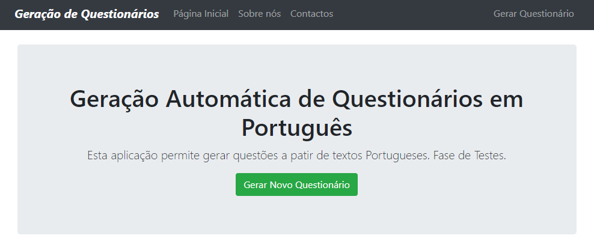

# Automatic Question Generation & Difficulty Control for the Portuguese Language

<p align="center">
    
</p>

## Overview - English
We present a **tool** capable of automatically **generating questions in Portuguese** with **controlled difficulty**. Our methodology is guided by three different kinds of questions: (A) Grammar, (B) Factoid (*wh-questions*), and (C) Pronoun reference. For the former (A), we have followed a rule-based approach by establishing rules aligned with the Portuguese grammar. For reading comprehension (B), we generate facoid (who-type) questions and, for that, we tested five different methods. The first one performs a syntax-based analysis by using the information obtained from Part-of-Speech tagging and Named Entity Recognition. The second carries out a semantic analysis of the sentences, through Semantic Role Labeling. The third method extracts the inherent dependencies within sentences using Dependency Parsing. The fourth takes advantage of the relative pronouns and adverbs found in the sentences. The fifth explores the usefulness and practicality of discourse connectors. Finally, for the last approach (C), we create pronoun reference questions, in which we do not only generate our questions but also the text excerpts they are generated from. We define heuristic functions that assign difficulty values for each question.

## Overview - Portuguese
Apresentamos uma **ferramenta** capaz de **gerar questões em Português**, de forma automática e com **controlo da dificuldade**. A nossa metodologia permite gerar questões sobre (A) Gramática, (B) Compreensão de Leitura e (C) Referenciação de Pronomes. A primeira abordagem (A) permite gerar questões gramaticais. Para isso, seguimos uma técnica baseada em regras, para a qual foram estabelecidas regras bem definidas, de acordo com a gramática portuguesa. A segunda abordagem (B) visa gerar questões de compreensão de leitura (factuais) e, para tal, foram testados cinco métodos diferentes. O primeiro faz uma análise baseada em sintaxe, utilizando as informações obtidas através do analisador morfológico e do reconhecimento de entidades mencionadas. O segundo elabora uma análise semântica das frases, através da rotulagem dos papéis semânticos. O terceiro método extrai as relações de dependências inerentes às frases, através da Análise de Dependências. O quarto tira proveito dos pronomes e advérbios relativos encontrados nas frases. O quinto explora a utilidade dos conectores de discurso. Finalmente, para a última abordagem (C), foram criadas perguntas sobre referenciação de pronomes, nas quais, para além das perguntas geradas, são também geradas as passagens de texto a partir das quais surgem as questões. Foram estabelecidas funções heurísticas que atribuem valores de dificuldade para cada uma das perguntas.

## Main Features
* Factoid Question Generation
* Grammar Question Generation
* Pronoun Reference Question Generation
* Difficulty Controllable

## Prerequisites
```bash
Python 3
Java
```

## Installation
1. Install [nlpnet](https://github.com/erickrf/nlpnet) (as indicated by the author):
    ```python
    git clone https://github.com/erickrf/nlpnet
    cd nlpnet-master
    cython network.pyx
    python setup.py install
    ```
    Note: We `do not` recommend installing `nlpnet` via `pip` due to some possible incompatibility issues.
2. Clone our project:
    ```python
    git clone https://github.com/bernardoleite/question-generation-portuguese
    ```
3. Install the Python packages from [requirements.txt](https://github.com/bernardoleite/question-generation-portuguese/blob/main/requirements.txt). If you are using a virtual environment for Python package management, you can install all python packages needed by using the following bash command:
    ```bash
    cd question-generation-portuguese/
    pip install -r requirements.txt
    ```
4. If you are using Windows you may need to specify the java path. Go to `question-generation-portuguese/gen_module/utils/config.py` and specificy your java path:
    ```bash
    JAVA_PATH = "....../bin/java.exe"
    ```

## Usage
You can use this software via **web application** or via **code** with `demo.py` script.

### Web Application 
1. After navigating to `question-generation-portuguese` folder, type the following command:
    ```bash
    python web_app.py
    ```
    The **first** time you run the program the following question will appear:
    ```bash
    Using the default treebank "pt_bosque" for language "pt".
    Would you like to download the models for: pt_bosque now? (Y/n)
    ```
    Please, type `Y` and press `Enter` for downloading the models.

2. In the end, the following message will appear:
    ```bash
        Debugger PIN: 123-123-123
        Running on http://127.0.0.1:XXXX/ (Press CTRL+C to quit)
    ```
    Open a browser at the given link. You should see the homepage:

    


### Via code with demo.py
1. Go to `demo.py` inside `question-generation-portuguese` folder. You can change some options:
    ```python
    # Example text
    text_example = """Type here your text."""

    # Number of questions (per question type).
    # Note: The system will attempt to generate up to the number of questions requested. It may not always be possible, depending on the text.
    NR_QUESTIONS_PER_TYPE = 10

    # ->DESIRED<- difficulty degree. You can request different difficulty degrees per question type.
    # Note: The system will try to maximize, minimize or randomize the difficulty. It does not mean that it is possible in all cases, depending on the text.
    DIFFICULTY_DEGREE = 'DIFF' # Possible options: 'DIFF', 'EASY' or 'RANDOM'

    # List of possible requests
    list_requests = [
        {'type': 'grammar', 'questions_requests': 
            [['g_sequence', NR_QUESTIONS_PER_TYPE, DIFFICULTY_DEGREE], 
            ['g_adverbstype', NR_QUESTIONS_PER_TYPE, DIFFICULTY_DEGREE], 
            ['g_dettype', NR_QUESTIONS_PER_TYPE, DIFFICULTY_DEGREE], 
            ........
            ........
            ........
        ]
    ```
2. Run `demo.py`:
    ```bash
    python demo.py
    ```
    The **first** time you run the program the following question will appear:
    ```bash
    Using the default treebank "pt_bosque" for language "pt".
    Would you like to download the models for: pt_bosque now? (Y/n)
    ```
    Please, type `Y` and press `Enter` for downloading the models.

3. If all goes well, you should see the generated questions printed and the following message at the end:
    ```bash
    Sucesso! Foi criado um novo questionário! Ver pasta -- results.
    ```
4. (Optionally) Go to newly created folder `results` for checking the generated questions in text files.


### Command Line
```bash
TODO
```

**Important note**: This is an experimental system, resulting from ongoing research. The generated questions may have grammatical errors(although we do our best not to 😉)

## Issues and Usage Q&A
To ask questions, report issues or request features, please use the GitHub Issue Tracker.

## Contributing
Contributions are what make the open source community such an amazing place to learn, inspire, and create. Any contributions you make are **greatly appreciated**.

If you have a suggestion that would make this better, please fork the repo and create a pull request. You can also simply open an issue with the tag "enhancement". Don't forget to give the project a star! Thanks in advance!

1. Fork the Project
2. Create your Feature Branch (`git checkout -b feature/AmazingFeature`)
3. Commit your Changes (`git commit -m 'Add some AmazingFeature'`)
4. Push to the Branch (`git push origin feature/AmazingFeature`)
5. Open a Pull Request

## License
### Project
This project is released under the **General Public License Version 3.0 (or later)**. For details, please see the file [LICENSE](https://github.com/bernardoleite/question-generation-portuguese/blob/main/LICENSE) in the root directory.

### Third Party Components
Additionaly, this project includes third party software components: [stanfordnlp](https://github.com/stanfordnlp/stanfordnlp), [stanfordner](https://nlp.stanford.edu/software/CRF-NER.html), [nlpnet](https://github.com/erickrf/nlpnet), and this [ner portuguese model](https://rdm.inesctec.pt/pt_PT/dataset/cs-2017-005/resource/5456d599-8aed-49ed-b77c-6f66fe97cfbe) from this [masters thesis](https://github.com/arop/ner-re-pt). Each of these components have their own license. Please see [stanfordnlp/license](https://github.com/stanfordnlp/stanfordnlp/blob/master/LICENSE), [stanfordner](https://github.com/bernardoleite/question-generation-portuguese/blob/main/gen_module/utils/stanford-ner/LICENSE.txt), [nlpnet](https://github.com/erickrf/nlpnet/blob/master/LICENSE.txt), and the [ner portuguese model](https://rdm.inesctec.pt/pt_PT/dataset/cs-2017-005/resource/5456d599-8aed-49ed-b77c-6f66fe97cfbe) correspondingly.

### Commercial Purposes
A commercial license may also be available for use in industrial projects, collaborations or distributors of proprietary software that do not wish to use the GPL v3 (or later). Please contact the author if you are interested.

## References
If you use this software in your work, please kindly cite our research:
```bibtex
@inproceedings{leite2023_rules,
    author={Bernardo Leite. and Henrique Cardoso.},
    title={Do Rules Still Rule? Comprehensive Evaluation of a Rule-Based Question Generation System},
    booktitle={Proceedings of the 15th International Conference on Computer Supported Education - Volume 2: CSEDU,},
    year={2023},
    pages={27-38},
    publisher={SciTePress},
    organization={INSTICC},
    doi={10.5220/0011852100003470},
    isbn={978-989-758-641-5},
    issn={2184-5026},
}
@mastersthesis{leite2020_ms,
    author = {Bernardo Leite},
    booktitle = {Dissertation for obtaining the Master Degree in Informatics and Computing Engineering},
    title = {Automatic Question Generation for the Portuguese Language},
    school = {Faculty of Engineering, University of Porto},
    url = {https://hdl.handle.net/10216/128541},
    day = {20},
    month = {07},
    year = {2020}
}
```
Also consider citing the third party software components. Please, see on their respective pages -- links above.

## Contacts
* Bernardo Leite, bernardo.leite@fe.up.pt
* Henrique Lopes Cardoso, hlc@fe.up.pt
* Luís Paulo Reis, lpreis@fe.up.pt